# Kubeflow v1 on Red Hat OpenShift Container Platform v4.6.9

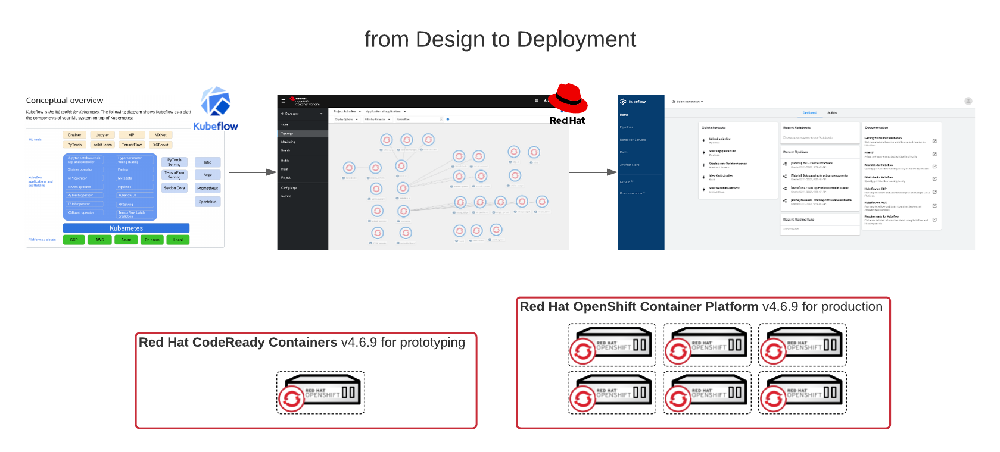

From this blog, you will learn how to install and uninstall the ML toolkit [Kubeflow](https://www.kubeflow.org/docs/about/kubeflow/) on [Red Hat OpenShift](https://www.kubeflow.org/docs/openshift/install-kubeflow/), what to watchout for and what to expect. The end goal is a tested tutorial steps through the end-to-end installation and uninstallation of Kubeflow on your cluster. 
## What to Expect
1. Pull down a local copy of the Kubeflow manifest from github in a woring directory.
1. Make necessary edits based on your cluster configuration (e.g. crc requires uncommenting overlay).
1. Build the deployment from the manifest locally.
1. Apply the deployment to the cluster.
1. command blocks include lines with `# Comments` and cli `commands`
## Testing Environment
These steps were prepared and tested on two variations of Red Hat OpenShift v4.6.9 and Red Hat CodeReady Containers v4.6.9.
## Prerequisites

Before you begin the Installation Procedure, you must have:
- [x] running OpenShift 4.6.9 or CodeReady Containers 4.6.9
- [x] cluster administrator permissions to the cluster
- [x] internet access
- [x] [oc](https://cloud.redhat.com/openshift/install) tool to configure OpenShift
- [x] [kfctl](https://github.com/kubeflow/kubeflow/releases/) tool to install/uninstall Kubeflow
## Tested Cluster Specifications

1. Red Hat OpenShift Container Platform v4.6.9 host in AWS Control Plane 3 x c5d.2xlarge and Worker Nodes 3 x m5.4xlarge
1. CodeReady Containers v4.6.9 on RHEL 8.3 with 8 vCPU, 32 GiB Memory, 100 GiB Disk Storage.
## Installation Procedure

This procedure was based on the steps from the [Install Kubeflow on OpenShift](https://www.kubeflow.org/docs/openshift/install-kubeflow/) procedure and modified.

**Create a local working directory .**

```
mkdir working; cd working
```
> Expected result: you are in a working directory on your local machine to work.

**Install oc command line tool**

Download, unpack and move the oc tool into your path for ease of use.

```
# Download the oc cli tool that matches your system
wget https://downloads-openshift-console.apps.cluster-3c14.3c14.example.opentlc.com/amd64/mac/oc.zip

# Unpack the file
unzip oc.zip

# Move the script into your path
mv oc /usr/local/bin
```

**Install kfctl command line tool**

Download, unpack and move the kfctl tool into your path for ease of use.

```
# Download the version of kfctl tool that matches your system
wget https://github.com/kubeflow/kfctl/archive/v1.2.0.zip

# Unpack the file
unzip v1.2.0.zip

# Move the script into your path
mv kfctl-1.2.0 /usr/local/bin
```

**Pull down a copy of the target KfDef file**

At the time this writing, there are two common sources to pull Kubeflow KfDef files that deploy the toolkit variants: 1) the origin Kubeflow repository and 2) the forked OpenDataHub-io manifests repository. There is another repository hosted by the OpenDataHub-io `odh-manfests` that is downstream of Kubeflow and introduces changes to be explored in upcoming posts. Because we need certain overlays operationalize Kubeflow for OpenShift, we will pull from option 2. Make sure you use the URL that points to the raw file format. 


```
wget https://raw.githubusercontent.com/opendatahub-io/manifests/v1.0-branch-openshift/kfdef/kfctl_openshift.yaml
```
> Expected result: `kfctl_openshift.yaml` file in your working directory

**Edit the yaml file for your cluster**

Do you need to edit before deploying? In summary, if you have a service mesh running, than yes. Else, no and you can skip this step. [Kubeflow deploys with Istio](https://www.kubeflow.org/docs/other-guides/istio-in-kubeflow/) and relies heavily on it for operation. If you already have Istio service mesh running in your target cluster, than you will need to comment out the configurations that install istio or the deployment will fail.

Possible file modifications:
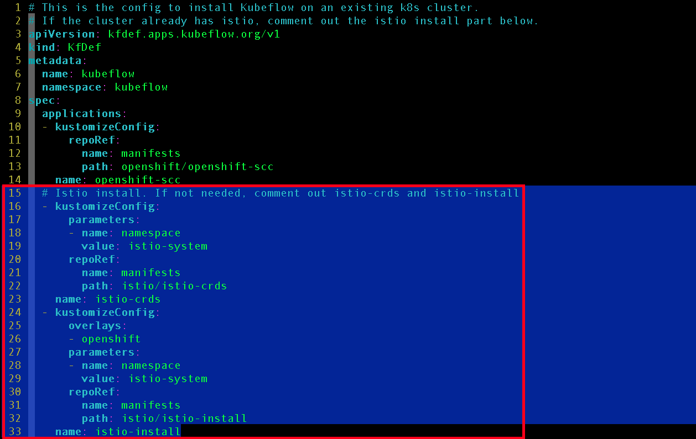
1. If you are running a cluster with an Istio service mesh installed (hint: look for a project 'istio-system') comment out lines 15-33 that contain istio-crds and istio-install blocks. 

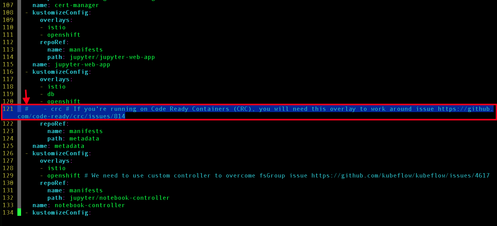
1. If your cluster is CodeReady Containers, you will have to uncomment the crc overlay.


>Expected result: a modified kfctl_openshift.yaml file edited for your cluster configuration.

**Build your deployment locally**

This is an optional step if you did not have to make any edits. Otherwise, the build command will generate a .cache and kustomize folder for with change configurations that deploy your configuration to your cluster.
```
kfctl_openshift.yaml build -f ktctl_openshift.yaml -V
```

Expected result: a .cache and kustomize folder with the manifest subdirs and files contained.

**Log into your cluster from the command line**

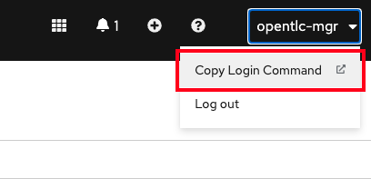

1. Login into your cluster from command line.
   - You can retrieve your command line login credentials from the OpenShift UI.

```
oc login --token=<some-token> --server=https://api.<cluster-domain>.example.opentlc.com:6443
```

>Expected result: you are logged into your cluster from the command line.

**Create `kubeflow` project**


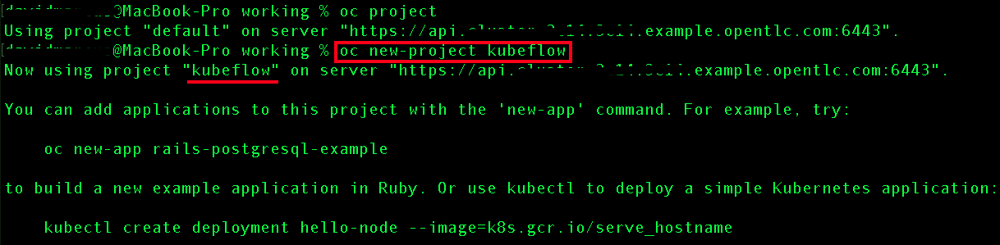

The kfctl_openshift.yaml file contains a namespace `kubeflow` under the metadata section. This namespace MUST be created prior to applying your deployment or the deployment will fail.

```
oc new-project kubeflow
```

>Expected result: you are in the newly created `kubeflow` project.

**Apply your local deployment to the cluster**

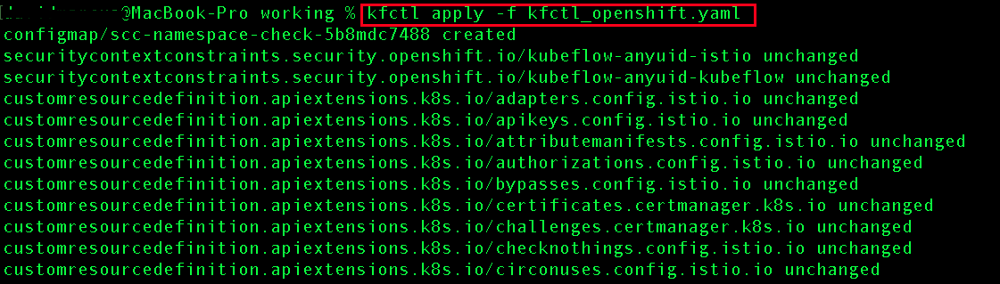

This step takes some time to apply the configurations, generate the objects, create the pods and resources. Success will start with `securitycontextconstraints.security.openshift.io/kubeflow-anyuid-istio`, which is the first configuration from the kfctl_openshift.yaml.

```
kfctl apply -f ktctl_openshift.yaml -V
```

>Expected result: kubeflow successfully installing

**Verify and Validate your deployment**

|Command Line|Administrator Perspective|Developer Perspective|
|-|-|-|
|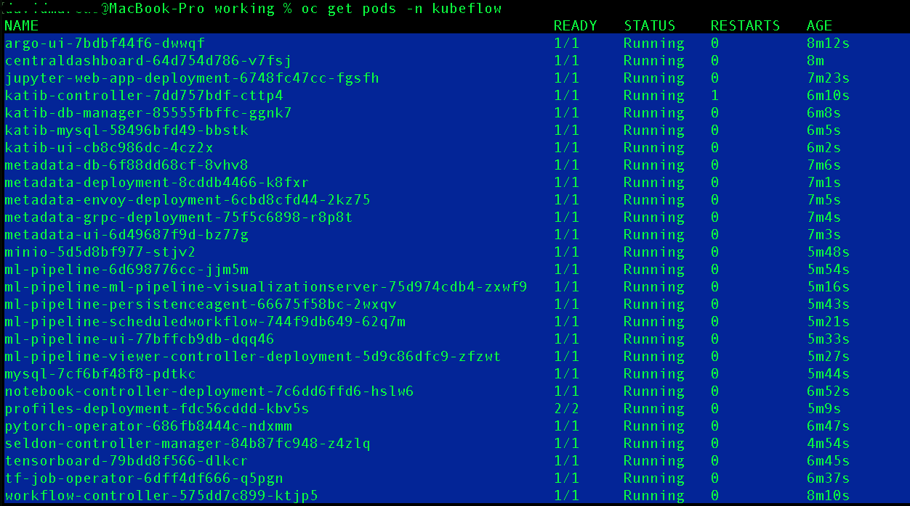|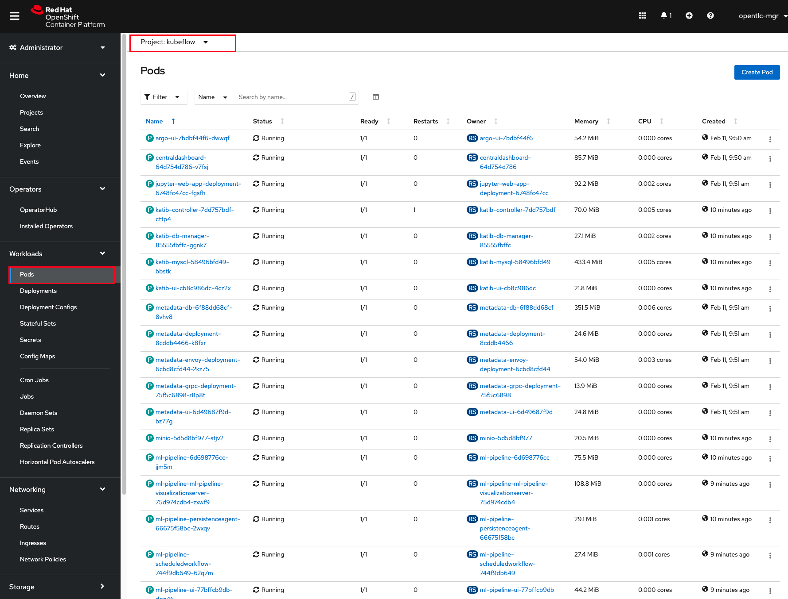|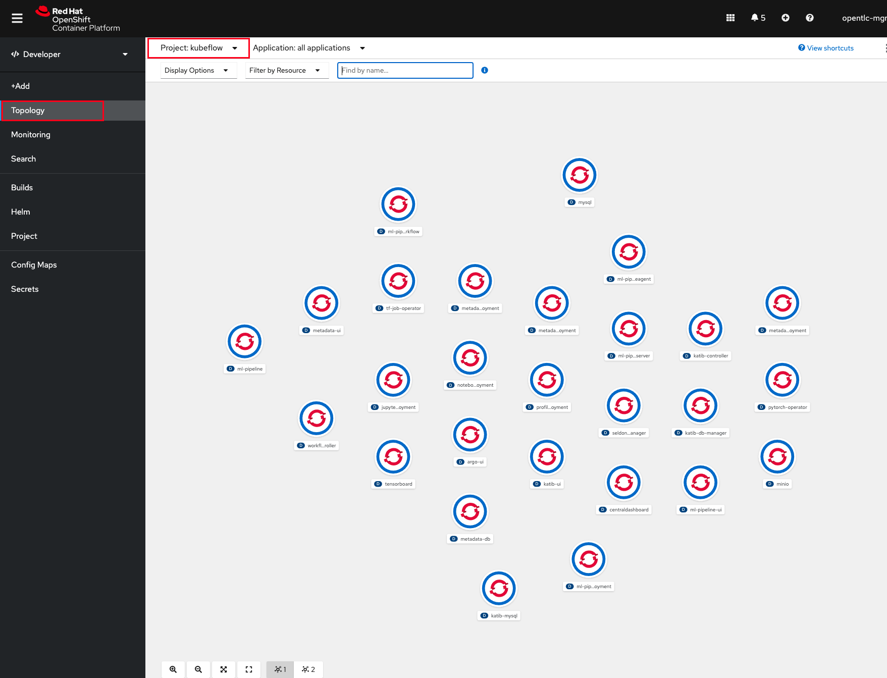|

You can check your runnining pods in the Kubeflow project via the command line or through the Red Hat OpenShift web UI.

**Retrieve your ingress route url**

|Command Line|Administrator Perspective|Developer Perspective|
|-|-|-|
|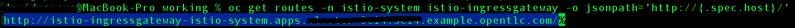|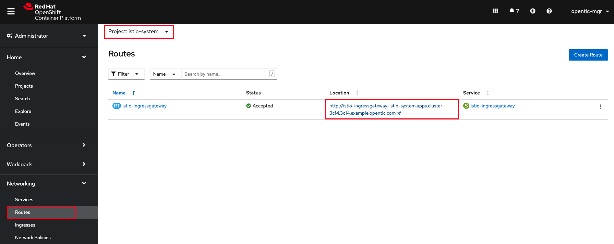|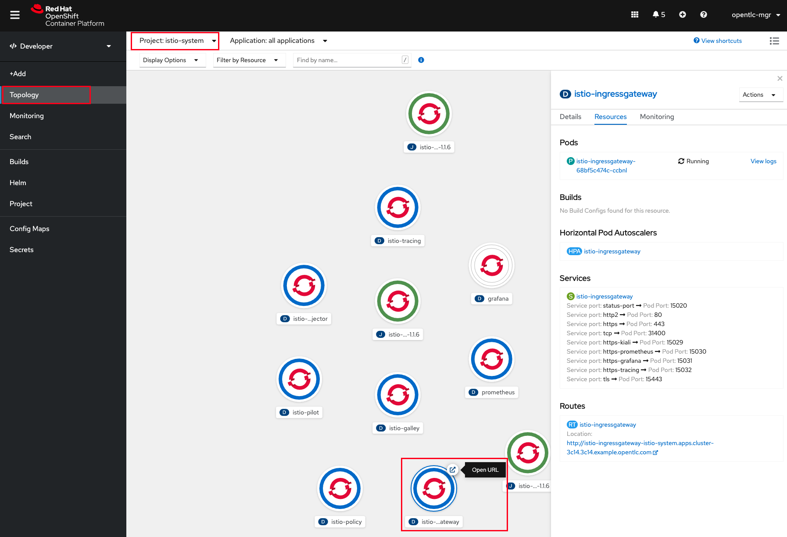|

You can access your Kubeflow Central Dashboard:
1. via command line, entering the oc get route command below and opening the uri in your browser
1. via Administrator perspective and
1. via Developer perspective navigating to the project `istio-system` and opeing the route from the `istio-ingressgateway` pod.

```
oc get routes -n istio-system istio-ingressgateway -o jsonpath='http://{.spec.host}/'
```

>Expected result: access to your Kubeflow Central Dashboard to begin the real work

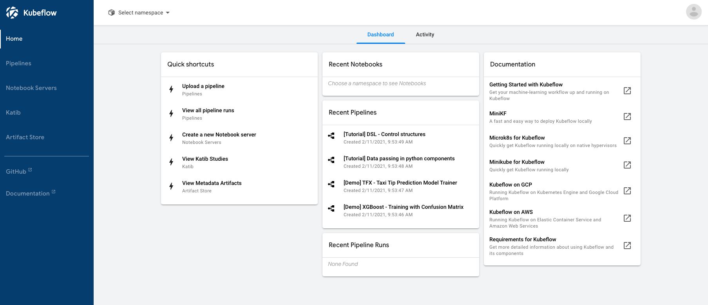

## Install Procedure Recap

```
# Create a working directory
mkdir working; cd working

# Download, unpack and move the oc and kfctl tools into your path
wget https://downloads-openshift-console.apps.cluster-3c14.3c14.example.opentlc.com/amd64/mac/oc.zip
wget https://github.com/kubeflow/kfctl/archive/v1.2.0.zip

# Unpack the files
unzip oc.zip
unzip v1.2.0.zip

# Move the scripts into your path
mv oc /usr/local/bin
mv kfctl-1.2.0 /usr/local/bin

# Download the kfctl_openshift.yaml file
wget https://raw.githubusercontent.com/opendatahub-io/manifests/v1.0-branch-openshift/kfdef/kfctl_openshift.yaml

# Make edits based on config (lines 15-33, line 21, etc.)
vi kfctl_openshift.yaml

# If edits were made
kfctl build -f kfctl_openshift.yaml

# Log into the cluster via CLI
oc login --token=<token> --server=https://api.<cluster>.com:6443

# Create Kubeflow namespace
oc new-project kubeflow

# If no edits were made
kfctl apply -f kfctl_openshift.yaml

# Get your ingress route
oc get routes -n istio-system istio-ingressgateway -o jsonpath='http://{.spec.host}/'
```
## Uninstall Procedure

Some resources may be cleanedup after running the kfctl delete command.

```
# Uninstall the deployment
kfctl delete --file=kfctl_openshift.yaml -V
rm -rf {.cache,kustomize}

# Delete webhook configurations
oc delete mutatingwebhookconfigurations.admissionregistration.k8s.io --all

oc delete validatingwebhookconfigurations.admissionregistration.k8s.io --all

# Delete projects
oc delete project kubeflow

oc delete project istio-system
```
