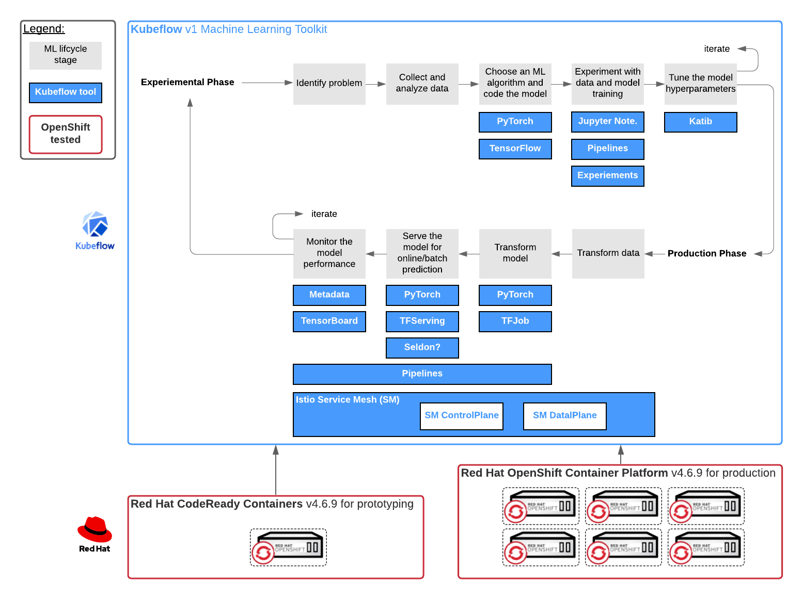
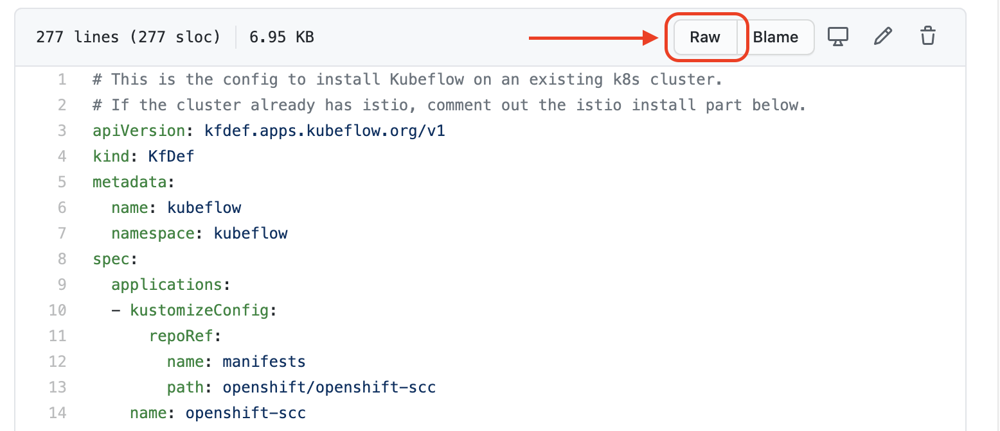

# Kubeflow v1 on Red Hat OpenShift Container Platform v4.6.9

This blog is geared towards installing the popular machine learning  toolkit, [Kubeflow](https://www.kubeflow.org/docs/about/kubeflow/), on leading enterprise Kubernetes platform [Red Hat OpenShift](https://www.kubeflow.org/docs/openshift/install-kubeflow/). We'll cover how to install and uninstall the ML toolkit, what to watchout for and what to expect. The end goal is to provide a tutorial that walks you through the installation to repeat on your cluster for developing, training and serving machine learning models. 

## Overview
1. Pull down a local copy of the Kubeflow manifest from github.
1. Make necessary edits based on your cluster (e.g. crc requires uncommenting overlay).
1. Build the deployment from the manifest locally.
1. Apply the deployment to the cluster.
## Testing Environment
These steps were prepared and tested on two variations of Red Hat OpenShift v4.6.9 and Red Hat CodeReady Containers v4.6.9.

## Prerequisites
- [x] running OpenShift 4.6.9 or CodeReady Containers 4.6.9
- [x] cluster administrator permissions
- [x] internet access

## Cluster Specifications

## Installation Procedure Table
|Step|Command(s)|Reason|
|-|-|-|
|Create a local working directory.|`mkdir working`|the kfctl build command will generate many sub-dirs and files.|
|Change into the working directory.|`cd working`|to start work|
|Pull down a copy of the target KfDef file|`wget 

## Installation Procedure
This procedure was based on the steps from the [Install Kubeflow on OpenShift](https://www.kubeflow.org/docs/openshift/install-kubeflow/) procedure and modified.

**Create a local working directory.**
```
mkdir working
```
> Expected result: a folder on your local machine to work.

**Change into the working directory.**
```
cd working
```
> Expected result: "Let's light this candle stick." ~Shepard.

**Pull down a copy of the target KfDef file**
At the time this writing, there are three common sources to pull Kubeflow KfDef files that deploy the toolkit variants: 1) the origin Kubeflow repository, 2) the forked OpenDataHub-io manifests repository, and 3) the OpenDataHub-io odh-manfests repository. Because we need certain overlays operationalize Kubeflow for OpenShift, we will pull from option 2. Make sure you use the URL that points to the raw file format. 

```
wget https://raw.githubusercontent.com/opendatahub-io/manifests/v1.0-branch-openshift/kfdef/kfctl_openshift.yaml
```
> Expected result: kfctl_openshift.yaml in the working directory

**Edit the yaml file for your cluster**
In summary, [Kubeflow deploys with Istio](https://www.kubeflow.org/docs/other-guides/istio-in-kubeflow/), unless you have an operational Istio that Kubeflow will integrate with (beyond the scope of this blog). Possible file modifications:
1. If you are running a cluster without an Istio service mesh installed (hint: look for a project 'istio-system'), you do not need to make any edits the kfctl_openshift.yaml. 
1. If you are running a cluster with an istio service mesh installed, you will need to comment out the istio-crds and istio-install blocks or the deployment will partially create objects and fail. 
1. If you are running a cluster with Red Hat Service Mesh installed, ...(NEED DETAILS)
1. If your cluster is CodeReady Containers, you will have to uncomment the crc overlay.
1. If you don't want all the tools, uncomment out the undesired block configurations.

*For example, if you have Istio running today, comment out these blocks.*
```
# istio service mesh is operational
#  - kustomizeConfig:
#      parameters:
#      - name: namespace
#        value: istio-system
#      repoRef:
#        name: manifests
#        path: istio/istio-crds
#    name: istio-crds
#  - kustomizeConfig:
#      overlays:
#      - openshift
#      parameters:
#      - name: namespace
#        value: istio-system
#      repoRef:
#        name: manifests
#        path: istio/istio-install
#    name: istio-install
```

*For example, if you are running on CodeReady Containers, uncomment the crc overlay*
```
      - crc # If you're running on Code Ready Containers (CRC), you will need this overlay to work around issue https://github.com/code-ready/crc/issues/814
```
>Expected result: a modified kfctl_openshift.yaml file tailored for your cluster.

**Build your deployment locally**
This is an optional step if you did not have to make any edits (TEST THIS). Otherwise, the build command will generate a .cache and kustomize folder for the configurations to deploy your configuration to your cluster.
```
kfctl_openshift.yaml build -f ktctl_openshift.yaml
```
Expected result: a .cache and kustomize folder with the manifest subdirs and files contained.

**Log into your cluster**
```
oc login -u <username> -p <password> https://api.<clutser>.com:6443
```
>Expected result: 

**Create `kubeflow` project**
```
oc new-project kubeflow
```

**Apply your local deployment to the cluster**
```
kfctl apply -f ktctl_openshift.yaml
```
>Expected result:

**Retrieve your ingress route url**
```
oc get routes -n istio-system istio-ingressgateway -o jsonpath='http://{.spec.host}/'
```
>Expected result:

## Uninstallation Procedure